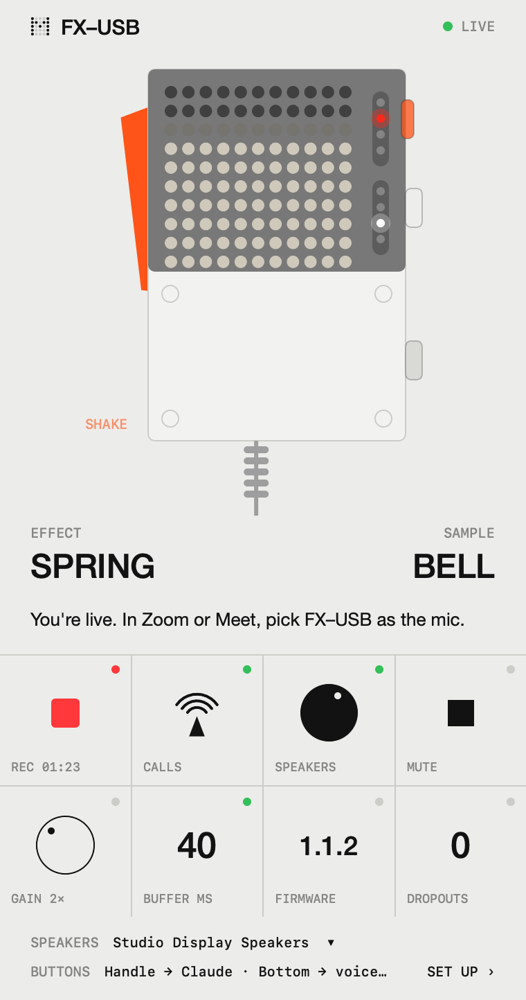
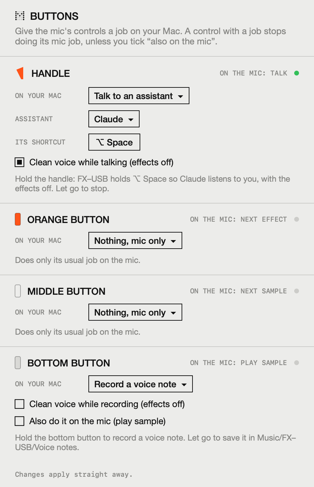

# FX–USB

**An unofficial Mac app that turns the teenage engineering EP–2350 FX MIC into a USB microphone.**

Guide and download page: **https://danilosierrac.github.io/fx-usb/**

> **Unofficial.** FX–USB is a fan-made app. It is not made, checked or supported by teenage engineering.
> EP–2350 and FX MIC are teenage engineering products and trademarks.



## What it does

The FX MIC has no USB audio. Its USB-C port carries a serial console and a small drive, and its 3.5 mm
plug is a line output that a Mac's headphone socket ignores. FX–USB bridges that gap in software:

- **Use the mic in any app.** Zoom, Meet, FaceTime, Voice Memos and Photo Booth hear it as a microphone called **FX–USB**.
- **Keep the effects.** Echo, spring, pixie and robot, plus the samples, come through, because they happen inside the mic.
- **See and change the mic.** The window and menu bar panel mirror the mic's lights, buttons and handle. You can switch effects and play samples from the Mac.
- **Hear yourself.** SPEAKERS plays the mic on any output, with a feedback guard that stops howling.
- **Record with one click** to a 48 kHz WAV in `~/Music/FX–USB`.
- **Nothing changes on the mic.** A small reader runs in the mic's memory while the app is open. Nothing is flashed or saved, and unplugging clears it.

## Status

| | |
|---|---|
| Version | 0.3, test version: installer on the [releases page](https://github.com/danilosierrac/fx-usb/releases/latest), ad-hoc signed, not notarized |
| Mac | Apple chip (M1 or newer), macOS 13 or later |
| Mic firmware | 1.1.1 and 1.1.2 tested. Other versions are tried only if the mic's audio setup matches, and are marked untested. |
| Audio | Measured with the factory test tone: 0 lost blocks, 0 dropouts, 40 ms buffer, also with the 3.5 mm jack in use |

## Download and install

1. Download **[FX-USB.pkg](https://github.com/danilosierrac/fx-usb/releases/latest/download/FX-USB.pkg)** from the [latest release](https://github.com/danilosierrac/fx-usb/releases/latest).
2. Double-click it. macOS says it can't check it for malicious software, because the app isn't notarized by Apple yet. Click **Done**.
3. Open **System Settings → Privacy & Security**, scroll down, click **Open Anyway** and confirm with your password.
4. Follow the installer. It puts FX–USB in Applications and adds the FX–USB microphone, then restarts Core Audio (sound drops for a second).

Or in Terminal, without the prompt:

```sh
curl -L -o /tmp/FX-USB.pkg https://github.com/danilosierrac/fx-usb/releases/latest/download/FX-USB.pkg && sudo installer -pkg /tmp/FX-USB.pkg -target /
```

To uninstall:

```sh
sudo rm -rf /Applications/FX-USB.app /Library/Audio/Plug-Ins/HAL/FX-USB.driver && sudo killall -9 coreaudiod
```

## Build from source

You need Xcode (for the microphone driver) and its command line tools.

```sh
git clone https://github.com/danilosierrac/fx-usb.git
cd fx-usb
sh build.sh             # builds dist/FX-USB.app and runs its self-test
sh driver/build.sh      # builds the FX–USB microphone driver (from BlackHole, GPL-3.0)
sh driver/install.sh    # installs it: asks for your Mac password and restarts Core Audio
open dist/FX-USB.app
```

Without the driver, the app falls back to [BlackHole 2ch](https://existential.audio/blackhole/) if you
have it, and call apps then list "BlackHole 2ch" instead of "FX–USB".

## Using it

1. Lift the mic's lower lid and connect a USB-C cable that carries data (some cheap cables only charge).
2. Open FX–USB. It finds the mic and shows **LIVE**.
3. In your call app, choose **FX–USB** as the microphone. With CALLS on, it is also the Mac's default input.
4. Push the handle in and talk. The mic is silent without the handle; that is how it is designed.

The orange button changes the effect (the red light shows which), the middle button picks a sample
(white light) and the bottom button plays it. The same buttons work on the drawing in the app.

## Buttons on your Mac

Give the mic's handle and buttons a job on your Mac. In the app, click **SET UP** next to BUTTONS.



| Job | What happens |
|---|---|
| Talk to an assistant | While you hold the control, FX–USB holds your assistant's talk shortcut (ChatGPT, Claude, Siri, Dictation…). **Clean voice** is on by default: the effects switch off while you talk, so the assistant hears you clearly, and come back when you let go. |
| Record a voice note | Hold to record, let go to save a WAV in `~/Music/FX–USB/Voice notes`. |
| Press a keyboard shortcut | One press, one shortcut. |
| Run a Shortcut | Runs any Shortcut from the Shortcuts app. |

- A button with a Mac job stops doing its mic job (next effect, next sample, play sample), unless you tick **also on the mic**. The handle always lets your voice through.
- Pressing keys for other apps needs a one-time permission: **System Settings → Privacy & Security → Accessibility → FX–USB**. The Buttons window links there.
- Use the push-to-talk or dictation shortcut from your assistant's own settings, then record the same keys in FX–USB.

## How it works

In short: the mic's own audio engine uses about half its CPU (around 70% with the jack in), so a
Python copy loop on the mic loses blocks. FX–USB borrows three spare DMA channels on the mic's RP2350
chip to copy every 568.9 µs audio block in hardware, with a timestamp, into a 32-slot ring. A small
loop ships those blocks over the USB console. On the Mac, the blocks are placed on the mic's clock,
buffered for 40 ms with drift tracking, and played into a virtual microphone built from BlackHole.

The full write-up, with packet formats and measurements, is in [docs/how-it-works.md](docs/how-it-works.md).
What was tried, measured and changed along the way is in [docs/engineering-log.md](docs/engineering-log.md).

## Project layout

| Path | What it is |
|---|---|
| `Sources/main.swift` | USB reader, packet decoder, timeline, jitter buffer, audio outputs, app delegate, test modes |
| `Sources/UI.swift` | SwiftUI window, menu bar panel, mic drawing, menu bar and app icons |
| `Sources/Buttons.swift` | Buttons window, key-combo recorder, and the engine that turns mic presses into Mac actions |
| `Sources/FeedbackGuard.swift` | Frequency shifter, howl detector with notch filters, limiter, room simulation |
| `Sources/fxmic_reader.py` | The reader uploaded to the mic's RAM (MicroPython + viper) |
| `driver/` | Builds and installs the FX–USB virtual microphone from BlackHole v0.7.1 |
| `release/` | `make-release.sh` builds `FX-USB.pkg` (app + microphone driver) and `FX-USB.zip` |
| `site/` | The guide page. `site/publish.sh` builds it and publishes it to the `gh-pages` branch for GitHub Pages; `site/make-og.sh` renders the social sharing card (`og-image.png`) |
| `tools/` | Python diagnostics: device queries and reader comparisons |

## Diagnostics

Close the app first; only one program can talk to the mic at a time.

```sh
APP='dist/FX-USB.app/Contents/MacOS/FXMic'
$APP --self-test                               # decoder, timeline, resampler, drift, feedback guard
$APP --devices                                 # audio devices with rate and buffer size
$APP --usb-test --seconds 10                   # stream statistics
$APP --pipeline-test /tmp/fx --seconds 15 --sample 3     # full Mac pipeline with a simulated output clock
$APP --loopback-test /tmp/fx --seconds 20 --capture      # real output, recorded back from the microphone
$APP --monitor-test "MacBook Pro Speakers" --seconds 15  # speaker path, silent
$APP --preview /tmp/fx-ui                      # render the window and panel to PNG
python3 tools/diag_stream.py --variant APP --blocks 10000 --sample 3   # mic-side loss and timing
```

`--sample 3` plays the mic's built-in 1 kHz test tone during the test and stops it afterwards.

## Troubleshooting

- **No sound in the call app.** The app is open and says LIVE, FX–USB is chosen as the microphone, and you are holding the handle.
- **"Connect FX–MIC by USB-C".** Try another cable; charge-only cables don't carry data. Close any other app using the mic's serial port.
- **"Supports firmware…".** Update the mic with teenage engineering's firmware from [their downloads page](https://teenage.engineering/downloads/ep-2350).
- **Distorted sound on the 3.5 mm plug.** That plug is a 2 V RMS line output. Turn the small volume dial under the lower lid down.

## Credits and license

- The FX–USB microphone driver is built from [BlackHole](https://github.com/ExistentialAudio/BlackHole) by Existential Audio, licensed under GPL-3.0. The driver source is fetched at build time and is not part of this repository.
- The app's source code does not have a license yet. Until one is added, all rights are reserved by the author.
- Made by Danilo Sierra.
